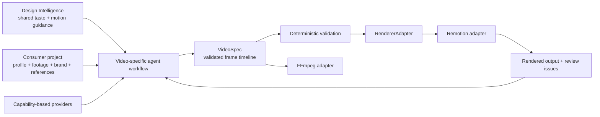

# Architecture

## Boundary

Video Intelligence translates creative decisions into a validated, renderer-neutral `VideoSpec`. Consumer projects own inputs and style. Adapters own execution. Providers own remote generation or review calls.

The arrows represent information flow, not package ownership. Design Intelligence is read at a pinned ref and is never vendored or mutated.

## Core model

`VideoSpec` version 1 uses integer frames as its canonical clock and contains:

- metadata and output format
- source or generated assets with provenance
- ordered scenes containing shots, graphics, and transitions
- audio tracks and captions
- explainable edit decisions
- normalized review issues and render records

`Scene.startFrame` is global. Shot and graphic start frames are scene-relative. Audio and caption frames are global. The schema rejects missing references, duplicate IDs, invalid transition durations, and entities that exceed their containers.

The model intentionally does not encode Remotion components, FFmpeg arguments, provider payloads, CSS, fonts, or brand tokens. Those details belong at boundaries.

## Modules

| Module | Responsibility | Explicit non-responsibility |
|---|---|---|
| `core/schemas` | Runtime contracts for specs and profiles | Rendering |
| `core/timeline` | Deterministic time conversion | Transcript alignment |
| `core/validation` | Stable, explainable quality checks | Contextual aesthetic verdicts |
| `core/projects` | Optional Design Intelligence checkout discovery | Syncing or installing it |
| `providers` | Capabilities and provider interfaces | Vendor API clients |
| `adapters/remotion` | Translate a render request to composition input | Own the domain model |
| `adapters/ffmpeg` | Describe media-processing work | Execute shell commands in Phase 1 |
| `skills` | Video-specific agent procedures | General design/taste guidance |

## Extension rules

Add a domain field only when more than one adapter or workflow needs it. Keep vendor-specific inputs in provider adapters. Add schema versions rather than changing existing semantics silently. Renderer packages may build richer internal plans, but must accept a validated `VideoSpec` at their boundary.

## Validation layers

1. Zod parsing proves structural and referential validity.
2. Deterministic rules enforce measurable profile constraints.
3. Renderer preflight will measure layout, fonts, media decodability, and text collisions.
4. Render review evaluates pacing, continuity, visual quality, lip sync, and whether the result matches the brief.

Layers 3 and 4 are Phase 2 work. Their absence must not be represented as successful render verification.

